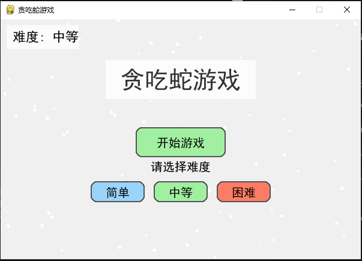

# 贪吃蛇游戏 (Snake Game)

## 项目概述

这是一个基于Python和Pygame库开发的贪吃蛇游戏，具有现代化的磨砂风格界面、直观的操作方式以及友好的用户交互体验。游戏支持键盘和鼠标操作，适合各年龄段的玩家。游戏提供三种难度级别，可根据玩家的熟练程度自由选择。



## 功能需求

### 核心功能

1. **游戏流程控制**
   - 开始界面：显示游戏标题和开始提示
   - 游戏运行：蛇的移动、食物生成、碰撞检测
   - 暂停功能：允许玩家随时暂停和继续游戏
   - 游戏结束：检测蛇撞墙或自咬，显示结束界面

2. **交互元素**
   - 开始按钮：点击开始新游戏
   - 结束按钮：随时结束当前游戏返回主界面
   - 难度选择：提供简单、中等、困难三种难度选项
   - 键盘控制：方向键控制蛇移动
   - 分数显示：实时更新当前得分

3. **游戏元素**
   - 蛇：由多个连续的绿色小方块组成，头部略深色
   - 食物：红色小圆点，吃到后蛇身增长，分数增加
   - 游戏区域：600×400像素的矩形区域

### 界面设计

1. **磨砂风格**
   - 半透明背景，带有随机小圆点增强质感
   - 文本和按钮使用圆角和阴影效果
   - 蛇身体采用渐变透明效果
   - 食物带有高光效果增强立体感

2. **界面元素**
   - 分数显示：左上角带磨砂背景的分数框
   - 难度显示：左上角带磨砂背景的难度提示
   - 消息提示：屏幕中央带磨砂背景的文本提示
   - 按钮：带有悬停效果的圆角按钮

## 操作说明

### 基本操作
- **开始游戏**：点击"开始游戏"按钮或按回车键
- **选择难度**：点击"简单"、"中等"或"困难"按钮设置游戏难度
- **控制移动**：使用键盘方向键（↑←↓→）控制蛇的移动方向
- **暂停游戏**：按空格键暂停，再次按空格键继续
- **结束游戏**：游戏中点击右上角"结束游戏"按钮返回主界面
- **退出程序**：按ESC键或关闭窗口

### 游戏规则
- 蛇不能撞墙（游戏区域边界）
- 蛇不能咬到自己的身体
- 每吃一个食物得1分，蛇身长度增加一节
- 食物随机出现在游戏区域内
- 不同难度下蛇移动速度不同：
  - 简单：速度较慢，适合新手（3格/秒）
  - 中等：标准速度（5格/秒）
  - 困难：速度较快，挑战性高（10格/秒）

## 技术实现

### 开发环境
- **编程语言**：Python
- **游戏引擎**：Pygame
- **操作系统**：Windows

### 主要模块
1. **初始化模块**：设置游戏窗口、颜色、字体等基本参数
2. **按钮类**：实现可交互的按钮元素
3. **游戏状态控制**：管理游戏的不同状态（初始、运行、暂停、结束）
4. **难度控制**：根据用户选择的难度调整游戏速度
5. **蛇移动逻辑**：实现蛇的移动、转向和生长机制
6. **碰撞检测**：检测蛇与食物、边界和自身的碰撞
7. **渲染模块**：绘制磨砂背景、蛇、食物和界面元素

## 安装与运行

### 环境要求
- Python 3.x
- Pygame 库

### 安装步骤
1. 安装Python：
   ```
   https://www.python.org/downloads/
   ```

2. 安装Pygame：
   ```
   pip install pygame
   ```

3. 运行游戏：
   ```
   python snake_game.py
   ```

## 未来扩展

- 添加背景音乐和音效
- 实现最高分记录功能
- 添加多种游戏模式
- 优化适配不同屏幕分辨率
- 自定义皮肤和颜色主题

---

© 2025 贪吃蛇游戏项目 | 保留所有权利 